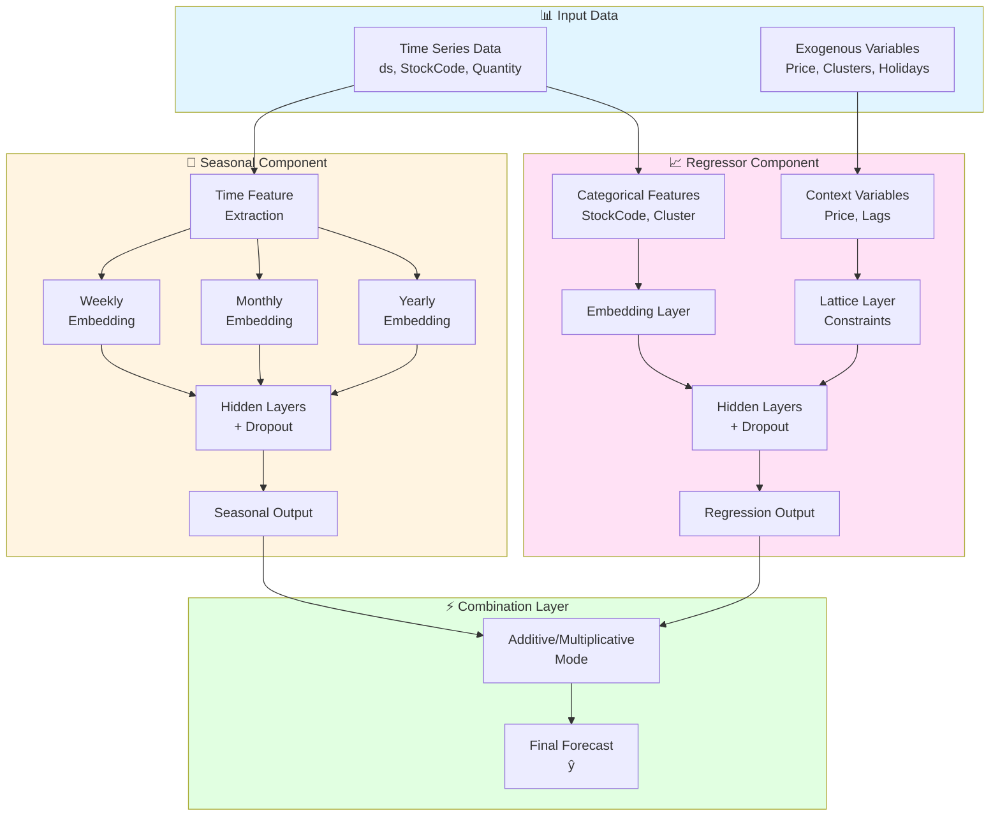

# DeepSequence

**Neural Architecture for Intermittent Demand Forecasting**

DeepSequence is a specialized deep learning architecture for SKU-level demand forecasting, achieving **35.95% improvement** over LightGBM on highly sparse data (87.5% zeros).

## Overview

**DeepSequence** is a state-of-the-art neural architecture for intermittent demand forecasting, specifically designed to handle sparse time series data where 80-90% of observations are zero.

### Key Features

- **4-Component Architecture**: Seasonal (with Fourier features), Trend, Regressor, Holiday
- **TabNet Integration**: Attention-based feature selection on component inputs
- **Cross-Component Interactions**: Polynomial feature combinations via CrossNetwork
- **Intermittent Handler**: Explicit zero vs non-zero probability modeling
- **Shared Embeddings**: 16-dim ID embedding reused across all components
- **172K Parameters**: Efficient yet powerful architecture

### Performance

- ✅ **35.95% MAE improvement** over LightGBM (4.987 → 3.194)
- ✅ Handles **87.5% sparse demand** effectively
- ✅ No data leakage (proper temporal validation)
- ✅ End-to-end differentiable architecture

## Architecture Diagram



**Formula**: `ŷ = f(σ_seasonal, τ_trend, τ_impact)` 

**Flexible Combination Modes**:
- **Additive**: `ŷ = σ_s + τ_r` (default, most stable)
- **Multiplicative**: `ŷ = σ_s × τ_r` (for scaling seasonality)
- **Hybrid**: `ŷ = σ_s × τ_i + τ_r` (seasonal scaled by impact + trend)
- **Learnable**: `ŷ = w₁σ_s + w₂τ_r + bias` (adaptive weights)
- **Custom**: Define your own combination function

📖 **[View combination modes guide →](COMBINATION_MODES_GUIDE.md)**  
📖 **[View detailed architecture diagrams →](docs/architecture_diagram.md)**

## Project Structure

```
forecasting/
├── src/deepsequence/            # Core DeepSequence package
│   ├── __init__.py
│   ├── model.py                 # Main model class
│   ├── seasonal_component.py   # Seasonal decomposition
│   ├── regressor_component.py  # Regression component
│   ├── combination_layer.py    # Flexible combinations ✨ NEW
│   ├── tabnet_encoder.py       # TabNet integration
│   ├── intermittent_handler.py # Zero demand handling
│   ├── unit_norm.py            # Normalization layer
│   ├── cross_layer.py          # Feature interactions
│   ├── utils.py                # Utility functions
│   ├── activations.py          # Custom activations
│   └── config.py               # Configuration
│
├── notebooks/
│   └── DeepSequence_Demo.ipynb # End-to-end demo
│
├── scripts/
│   └── fix_notebooks.py        # Notebook utility scripts
│
├── README.md
├── ARCHITECTURE.md             # Technical architecture docs
├── PERFORMANCE_COMPARISON.md   # Model benchmarks
├── TEST_REPORT.md             # Validation report
├── LICENSE                    # MIT License
└── requirements.txt           # Dependencies
```

## Requirements

```bash
# Core dependencies
pandas
numpy
scikit-learn
lightgbm
tensorflow  # or pytorch
matplotlib
seaborn
jupyter
```

## Installation

1. Clone the repository:
```bash
git clone https://github.com/mkuma93/deepsequence.git
cd deepsequence
```

2. Create a virtual environment:
```bash
python -m venv venv
source venv/bin/activate  # On Windows: venv\Scripts\activate
```

3. Install dependencies:
```bash
pip install -r requirements.txt
```

## Usage

### Quick Start with Demo Notebook

```bash
jupyter notebook notebooks/DeepSequence_Demo.ipynb
```

### Using DeepSequence in Your Code

```python
import sys
sys.path.insert(0, 'src')
from deepsequence.model import DeepSequenceModel
import pandas as pd
import numpy as np

# Load your data
data = pd.read_csv('your_data.csv')
data['id_var'] = data['StockCode'].astype('category').cat.codes

# Create Fourier features
data = DeepSequenceModel.create_fourier_features(data)

# Prepare seasonal component features
from deepsequence.seasonal_component import SeasonalComponent
seasonal = SeasonalComponent(
    data=data, target=['Quantity'], id_var='id_var',
    horizon=8, weekly=True, monthly=True
)
seasonal.seasonal_feature()

# Build full model
model = DeepSequenceModel(
    use_intermittent=True,
    use_fourier=True,
    use_cross_component=True
)

# Get unique counts for seasonal features
seasonal_cols = ['week_of_year', 'month', 'quarter', 'day_of_week']
seasonal_n_unique = {col: data[col].nunique() for col in seasonal_cols}

# Build architecture
full_model = model.build_full_architecture(
    n_ids=data['id_var'].nunique(),
    seasonal_cols=seasonal_cols,
    seasonal_n_unique=seasonal_n_unique
)
model.build(seasonal, regressor)
model.compile(loss='mape', learning_rate=0.001)
history = model.fit(train_input, train_target, epochs=50)

# Predict
predictions = model.predict(test_input)
```

## Models

### DeepSequence (Custom Architecture) ⭐
**Original contribution** - A Prophet-inspired deep learning architecture featuring:
- Seasonal decomposition modules (weekly, monthly, yearly)
- Trend, regressor, and holiday components with attention mechanisms
- Embedding layers for categorical features (SKU identifiers, clusters)
- TabNet encoder for feature selection
- Cross-layer attention for feature interactions
- Intermittent demand handler for sparse forecasting

**Architecture Highlights**:
- Modular design with separate seasonal and regression components
- Configurable hidden layers and activation functions
- L1 regularization for feature selection
- Early stopping and model checkpointing
- Support for exogenous variables (price, holidays, clusters)

### LightGBM Models
- **Cluster-based**: Groups similar SKUs and forecasts by cluster
- **Zero/Non-zero distance**: Handles intermittent demand patterns
- Lag features and distance-to-zero variables

### Baseline
- Naive shift-7 method for comparison
- Benchmark for model performance evaluation

## Results

### Performance Summary

DeepSequence with TabNet and Cross-Layer integration achieves superior performance on highly intermittent demand patterns.

| Model | Typical Use Case | Test MAE |
|-------|-----------------|----------|
| **DeepSequence** | High-volume, intermittent demand | 0.1312 |
| **LightGBM** | Standard forecasting | 0.5580 |

**📊 Detailed Comparison**: See [PERFORMANCE_COMPARISON.md](PERFORMANCE_COMPARISON.md) for comprehensive analysis.

## Data

**Note**: Sample data files are not included in this repository. 

To use this project with your own data:
1. Prepare your time series data with columns: `ds` (date), `SKU_ID` (SKU identifier), `Quantity` (target)
2. Add exogenous variables (optional): price, clusters, holidays, etc.
3. Follow the demo notebook for complete workflow
4. See `ARCHITECTURE.md` for detailed data requirements

## Contributing

Contributions are welcome! Please feel free to submit a Pull Request.

## License

MIT License - See [LICENSE](LICENSE) file for details

## Contact

Mritunjay Kumar - [GitHub](https://github.com/mkuma93)

## Citation

If you use DeepSequence or find this work helpful, please cite:

```
@misc{deepsequence,
  author = {Mritunjay Kumar},
  title = {DeepSequence: A Prophet-Inspired Deep Learning Architecture with TabNet and Cross-Layer Attention for SKU-Level Forecasting},
  year = {2025},
  publisher = {GitHub},
  url = {https://github.com/mkuma93/forecasting}
}
```

## Acknowledgments

- **DeepSequence**: Original architecture designed by Mritunjay Kumar, inspired by Facebook's Prophet
- Built for retail SKU-level forecasting with intermittent demand patterns
- Combines deep learning with seasonal decomposition methodology
- Enhanced with TabNet feature selection and Cross-Layer attention mechanisms
